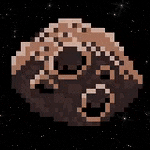

# Normal Difficulty

## Assignment 1 - Setting the Space Background (CSS)

1. Create a CSS file inside the `/styles` folder

2. Import your new CSS file into the `index.html`, by using the tag `<link rel="stylesheet" href="">` - replacing the value for `href` with the location of your CSS file. Make sure you place this code in the `<head></head>` tag.

3. Write styles for the `<body>` tag - set the properties `width` and `height` to take up the full viewport width and height

4. Remove the margin for the `<body>` tag

5. Set the `images/space.png` image as the background image for the body

6. Make the background image repeat across the page

## Assignment 2 - Animating the background (CSS)

We are going to animate the background to give the simulation of travelling through space.

In your CSS file:

1. Create a CSS animation which moves the background position of the body. I would recommend using `px` (pixels). Your start value should be 0 and your end value should be the maximum dimension of the image.

2. Set the CSS animation to the `body` tag. Don't forget the other animation properties, such as `animation-timing-function`, `animation-duration` and `animation-iteration-count`

3. Play around with the animation values until you are satisfied with your result

> Hint: You can also use a negative number. A negative number means the image will travel "backwards". A positive number means the image will travel "forwards". This number will determine the direction of the animation.

> Hint: Is the animation not smooth, does it "jump"? You should move the background by the same distance as the file dimensions.

> Hint: Check the file dimensions for the image `space.png` and move the background in pixels (`px`), not percentages (`%`)

## Assignment 3 - Adding the player (JavaScript)

Now we have our animated background, let's add the player. Our player in this case is a spaceship graphic with a character inside.

For the player, we are going to use an ES6 Class. Why?

A Class helps us to organise common functions together, by "grouping" them together. For example, we might have 1 function which draws (renders) the player on the screen, and another function to move the player. These are common functions, because they relate to the player. We will group them together.

1. Create a JavaScript file inside the `/js` folder

2. Import your new JavaScript file into the `index.html`, by using the tag `` - replacing the value for `src` with the location of your JavaScript file. Make sure you place this code after the `<body></body>` tag.

3. Write an ES6 class called "Player".

4. In the constructor method for the ES6 class, create a new DOM object of type `
`. Assign this to the class property `node`. This will be the DOM object for your player.

    > Hint: Try and think what properties you might want to use in your constructor

5. Update your code so that it attaches your `node` property to the `<body>` tag automatically, when the ES6 class is instantiated with the `new` keyword

## Assignment 4 - Adding the player (CSS)

1. Create a CSS style for this DOM object which includes the image `/images/spaceship.png` as the element's background image. Other CSS properties which you might like to think about are `width` and `height`, `background-size` and perhaps `background-repeat`.

    > Hint: Try to separate your CSS from your JavaScript where possible. Use a CSS class to manage the styling of the HTML element.

2. Attach your CSS style to the DOM object in your class using the `classList` interface.

3. Play around with the styles until you are happy with the result.

When you run the code `new Player()` in your JavaScript you should see your player character on the screen.

## Assignment 5 - Player movement (JavaScript)

Currently the player character is static (it does not move) - but we are going to change this. We want to allow the user to control the "player" character by using their keyboard.

1. Inside your class, add an event listener to listen for the keyboard `keydown` event.

2. Respond to the gamer keys "W A S D" or optionally, the keyboard arrow keys, and make the player character move accordingly.

    W = up
    
    A = left
    
    S = down
    
    D = right
    
    If you want to respond to the arrow keys, you need to match on the strings:
    
    "ArrowUp"
    
    "ArrowLeft"
    
    "ArrowDown"
    
    "ArrowRight"
    
    Create methods for each movement, for example, you might create a method called "moveUp" to move the DOM object up. Or a method called "moveDown" to move the DOM object down.
    
    > Hint: Don't forget to also respond to the lowercase version of these keys, for example, "S" and "s" should perform the same action

    > Hint: Create methods in your class to control movement

    > Hint: Don't forget your class property, `node` is shared throughout the class - which means all your methods can read it.

## Assignment 6 - Adding an asteroid (JavaScript & CSS)

Just as you did for the player character, we will use an ES6 class for the asteroid.

1. Write an ES6 class called "Asteroid"

2. In the constructor method for the ES6 class, create a new DOM object of type `
`. Assign this to the class property `node`. This will be the DOM object for your player.

3. Update your code so that it attaches your `node` property to the `<body>` tag automatically, when the ES6 class is instantiated with the `new` keyword

4. Create a CSS style for this DOM object which includes the image `/images/asteroid.png` as the element's background image. Other CSS properties which you might like to think about are `width` and `height`, `background-size` and perhaps `background-repeat`.

5. Attach your CSS style to the DOM object in your class using the `classList` interface.

6. In your ES6 class for the asteroid, give the asteroid a random Y position (CSS: `top`)

    > Hint: Consider writing this logic in a separate method

7. In your ES6 class for the asteroid, give the asteroid an X position. Use the CSS property `right` and set it to `0` so that it appears on the far right of the browser.

8. Play around with the styles until you are happy with the result.

When you run the code `new Asteroid()` you should see a new asteroid in the browser.

## Assignment 7 - Giving a behaviour to the asteroid

The asteroid doesn't look so fun when it doesn't move.

Let's make it move.

1. Within the asteroid class, create a new method called "intervalMoveX", which uses the `setInterval` function to set a new X position (CSS `right` property) to give the feeling the asteroid is moving from the far right of the window to the far left. Choose an interval timing value of your choice.

    > Hint: Don't put your logic in one method. Separate it into multiple methods, and use class properties to share information between them

## Assignment 8 - Remove the asteroid

We can't keep the asteroid on the screen forever. Once it reaches the far left of the browser, we must remove it from the DOM. We do this to prevent from consuming too many resources in the browser.

We will checking the X position of the asteroid (CSS `right` property). Once it reaches it's desired destination, we will remove it from the DOM.

1. Create a `destroy` method. Use the DOM `remove()` method to remove the `node` DOM object from the DOM.

2. In the `setInterval` function you created in Assignment 6, check the x position of the element. The  CSS `right` property. If it is greater than the width of the `<body>` tag (use `document.body.clientWidth`), then call the `destroy()` method.

> Hint: Don't put your logic in one method. Separate it into multiple methods, and use class properties to share information between them

## Assignment 9 - Multiple asteroids

One asteroid is not enough! Let's add more, to make it more interesting.

1. Add a new asteroid (or multiple asteroids) in the browser at an interval of your choosing using another `setInterval` function

## Assignment 10 - What other improvements would you make?

1. Add a title to the page

2. Clean up the styles
